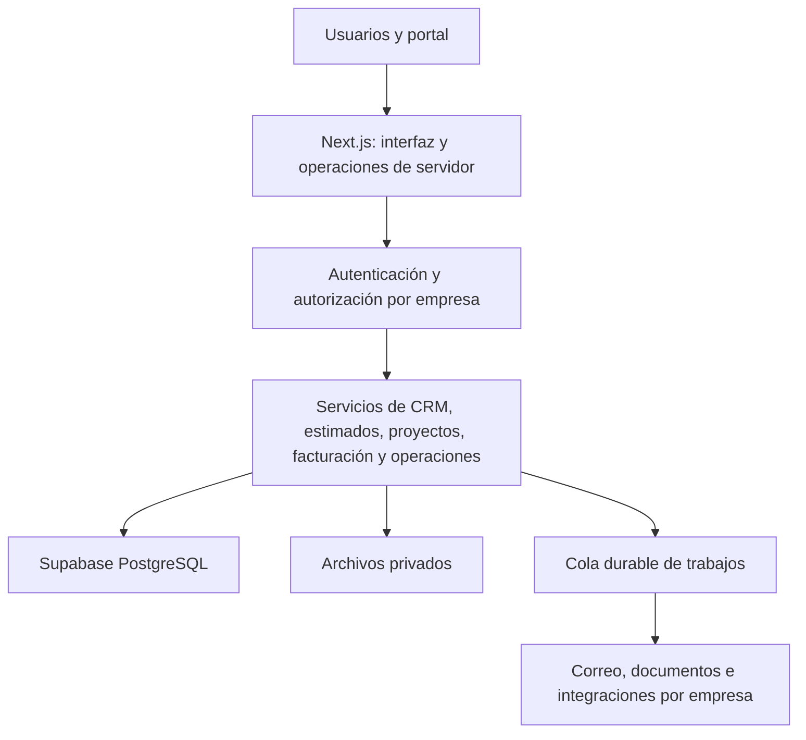

# Arquitectura propuesta

Estado: arquitectura objetivo con primera base implementada. Autenticación, empresas, permisos y clientes tienen implementación inicial; archivos, colas, integraciones y dominios restantes siguen pendientes. Alcance confirmado: varias empresas y todos los módulos de ADT Admin.

## Estructura

Se propone una aplicación Next.js organizada por dominios, con una base común. Evita desplegar una copia distinta de ADT por cliente y permite conservar reglas transaccionales entre módulos.

TypeScript para la aplicación; Tailwind CSS y shadcn/ui para la interfaz. El panel y las acciones de ADT determinan los recorridos que deben conservarse.

## Empresas y permisos

Modelo propuesto: `companies`, `memberships`, roles/permisos, configuración, catálogo de módulos y auditoría. Un usuario podrá pertenecer a varias empresas con permisos diferentes.

Cada registro de negocio tendrá empresa obligatoria. Las relaciones y restricciones impedirán asociar un documento de una empresa a un cliente de otra. Las operaciones de servidor comprobarán usuario, membresía, permiso y acceso al recurso; no confiarán en la empresa enviada por el formulario.

Se configurarán privilegios y políticas RLS por operación y se probará aislamiento entre dos empresas. Las credenciales privilegiadas, que pueden eludir RLS, se limitarán al servidor y a operaciones expresamente autorizadas. Véase [Supabase: RLS](https://supabase.com/docs/guides/database/postgres/row-level-security).

Todos los módulos estarán incluidos; los permisos del usuario controlarán sus acciones. La creación de planes de cobro o restricciones comerciales por módulo no se presume autorizada por pedir varias empresas.

## Datos y archivos

Dinero con precisión exacta, cálculo definitivo en servidor y conservación de moneda, fecha original, numeración y estado. Horas normalizadas para cálculo y presentación en la zona horaria de la empresa.

Recibos, fotos, contratos, firmas y documentos se almacenarán de forma privada, con autorización para cada recurso. También se separarán exportaciones, caché y colas offline por usuario/empresa.

La auditoría conservará actor, empresa, acción y procedencia. Las correcciones se registrarán sin alterar la evidencia original.

## Integraciones y trabajos

Las conexiones externas se configurarán por empresa. Bancos, correo, firma y pagos tendrán estado explícito: pendiente, configurado, autorizado o verificado. La migración no reenviará correos ni repetirá pagos.

Recordatorios, sincronización y generación de documentos usarán una cola durable con reintentos e idempotencia. El ejecutor debe ser compatible con el alojamiento; no dependerá del navegador.

## Transición

La nueva aplicación usará Supabase como destino. Si la auditoría demuestra necesario un adaptador temporal de lectura a ADT, se limitará a la empresa ADT y a operaciones definidas. No se propone un proxy general ni duplicar escrituras.

Cliente, estimado, proyecto, factura y pago deben mantener consistencia. Los cortes se agruparán por dependencia, con un solo sistema autorizado a escribir en cada grupo.

## Decisiones operativas pendientes

- El proyecto Supabase `SaasAlldecor` tiene la estructura inicial aplicada y la aplicación local configurada. Falta definir la separación de pruebas/producción y validar el primer recorrido de usuario confirmado.
- Proveedor/plan de alojamiento compatible con uso comercial. [Vercel Hobby limita ese uso](https://vercel.com/docs/limits/fair-use-guidelines).
- Proveedores e identidades de envío de cada integración y método de incorporación de usuarios.
- Dominio, ventanas de mantenimiento y objetivos de disponibilidad/recuperación.
- Volumen inicial y crecimiento esperado; medir antes de comprometer costes y capacidad.

Se comienza con una aplicación modular y una base compartida con aislamiento por empresa. Una base por empresa ofrece aislamiento operativo adicional, pero aumenta migraciones y mantenimiento. Revisar esa elección si los clientes requieren residencia, restauración o rendimiento independientes.
